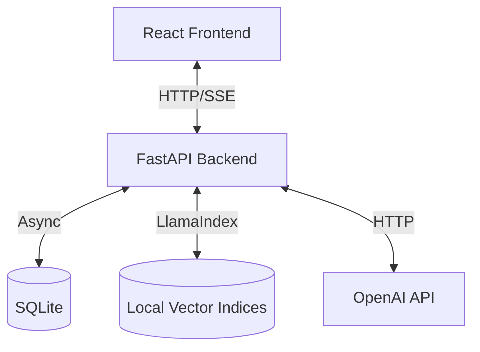

# Azure Architecture Assistant

**Version 4.0.0** - Unified Python Backend with Modern React Architecture

A proof-of-concept application that helps Azure Solution Architects analyze project documents, clarify requirements through interactive chat, generate high-level Azure architecture proposals, and query multiple Azure knowledge bases.

## 📚 Table of Contents

1.  [System Architecture](#system-architecture)
2.  [Data Architecture](#data-architecture)
3.  [Configuration & Environment](#configuration--environment)
4.  [Ingestion System Deep Dive](#ingestion-system-deep-dive)
5.  [API Reference](#api-reference)
6.  [Frontend Architecture](#frontend-architecture)
7.  [Development Setup](#development-setup)
8.  [Known Limitations](#known-limitations)

---

## System Architecture

The application follows a **Unified Python Backend** architecture, replacing the previous split TypeScript/Python stack.

### High-Level Overview



### Backend Design Patterns

1.  **Modular Router Pattern**: All API modules (`backend/app/routers/*`) follow a strict 3-file structure:
    *   `models.py`: Pydantic models for Request/Response schemas.
    *   `operations.py`: Business logic and service orchestration.
    *   `router.py`: FastAPI endpoint definitions and dependency injection.

2.  **Singleton Service Registry**: Heavy services are instantiated once and cached to manage memory usage (crucial for Vector Indices).
    *   **Registry**: `backend/app/service_registry.py`
    *   **Managed Services**: `KBManager`, `MultiSourceQueryService`, `IngestionService`.
    *   **Lifecycle**: Services are lazy-loaded on first use or preloaded at startup. `invalidate_kb_manager()` forces a reload when configuration changes.

3.  **Asyncio Ingestion Pipeline**:
    *   The ingestion system (`backend/app/ingestion/service.py`) uses `asyncio.Task` to run non-blocking background jobs.
    *   State is persisted to disk (`data/ingestion/jobs/*.json`) to survive server restarts.

---

## Data Architecture

The application uses a hybrid storage approach: **SQLite** for relational data and **File System** for unstructured data and vector indices.

### 1. Relational Database (SQLite)
**Path**: `backend/data/projects.db`

| Table | Description | Key Columns |
| :--- | :--- | :--- |
| `projects` | Project metadata | `id` (UUID), `name`, `text_requirements` |
| `project_documents` | Uploaded file references | `id`, `project_id`, `filename`, `content` |
| `project_states` | Extracted architecture state | `project_id` (FK), `state` (JSON Blob) |
| `conversation_messages` | Chat history | `id`, `project_id`, `role`, `content` |

### 2. Knowledge Base Storage (File System)
**Root**: `backend/data/knowledge_bases/{kb_id}/`

| Directory/File | Format | Description |
| :--- | :--- | :--- |
| `documents/` | `{id:04d}_{name}.txt` | Cleaned, plain-text version of crawled content. Used as the source of truth for indexing. |
| `index/` | LlamaIndex Files | Vector store persistence (`default__vector_store.json`, `docstore.json`, `index_store.json`). |
| `crawl_checkpoint.json` | JSON | Tracks crawler progress (visited URLs, last ID). |
| `index_checkpoint.json` | JSON | Tracks indexing progress (last indexed document ID). |

### 3. Ingestion State Persistence
**Root**: `backend/data/ingestion/jobs/`

*   `{kb_id}.json`: Snapshots of active/completed jobs. Contains status, progress, error logs, and metrics.
*   `index.json`: A simple registry of known job IDs.

---

## Configuration & Environment

### Environment Variables (`.env`)

| Variable | Required | Default | Description |
| :--- | :--- | :--- | :--- |
| `OPENAI_API_KEY` | **Yes** | - | API Key for OpenAI services. |
| `PYTHON_PORT` | No | `8000` | Port for the FastAPI backend. |
| `LOG_LEVEL` | No | `INFO` | Logging verbosity. |
| `AZURE_OPENAI_API_KEY` | No | - | Optional: For Azure OpenAI support. |
| `OPENAI_API_ENDPOINT` | No | - | Optional: Azure OpenAI Endpoint URL. |

### Knowledge Base Configuration (`config.json`)
**Path**: `backend/data/knowledge_bases/config.json`

This file defines the registry of available Knowledge Bases.

```json
{
  "knowledge_bases": [
    {
      "id": "waf",
      "name": "Azure Well-Architected Framework",
      "description": "Best practices for Azure workloads",
      "status": "active",
      "priority": 1,
      "profiles": ["chat", "proposal"],
      "source_url": "https://learn.microsoft.com/en-us/azure/well-architected/",
      "paths": {
        "index": "data/knowledge_bases/waf/index",
        "documents": "data/knowledge_bases/waf/documents"
      },
      "chunk_size": 800,       // Default: 800 tokens
      "chunk_overlap": 120,    // Default: 120 tokens
      "embedding_model": "text-embedding-3-small"
    }
  ]
}
```

---

## Ingestion System Deep Dive

The ingestion system is designed for resilience and observability.

### Architecture
*   **Service**: `IngestionService` (Singleton) manages `asyncio` tasks.
*   **Pipeline**: `IngestionPipeline` orchestrates three distinct phases:
    1.  **Crawling**: Fetches content using `DocumentCrawler`.
    2.  **Cleaning**: Normalizes text using `DocumentCleaner`. Saves to `documents/`.
    3.  **Indexing**: Chunks and embeds using `IndexBuilder`. Saves to `index/`.

### Job Lifecycle
1.  **Start**: Creates a `Job` entry and spawns a background task.
2.  **Running**: Updates in-memory state and flushes to disk (`data/ingestion/jobs/{kb_id}.json`) on every progress tick.
3.  **Pause/Resume**: Supported via `IngestionService.pause()` / `resume()`. Pausing suspends the task; Resuming re-hydrates state from disk.
4.  **Cancellation**: Sets a `cancel_requested` flag which the pipeline checks periodically.

---

## API Reference

### Project Management (`/api/projects`)
*   `POST /` - Create Project.
*   `GET /` - List Projects.
*   `POST /{id}/documents` - Upload files (multipart/form-data).
*   `POST /{id}/analyze-docs` - Trigger LLM analysis of uploaded docs.
*   `POST /{id}/chat` - Send message. Returns updated `ProjectState`.
*   `GET /{id}/architecture/proposal` - **SSE Endpoint**. Streams proposal generation events.

#### SSE Events (Proposal)
| Event | Description |
| :--- | :--- |
| `started` | Initialization (Router). |
| `analyzing` | Analyzing project requirements (LLMService). |
| `generating` | LLM generation in progress (LLMService). |
| `completed` | Generation finished (LLMService). |
| `done` | Final response. Payload contains full Markdown proposal. |
| `error` | Failure. Payload contains error details. |

### Knowledge Base Management (`/api/kb`)
*   `GET /list` - List configured KBs.
*   `GET /health` - Check index readiness (checks for existence of vector store files).

### Ingestion (`/api/ingestion`)
*   `POST /kb/create` - Register new KB in `config.json`.
*   `POST /kb/{id}/start` - Spawn ingestion job.
*   `GET /kb/{id}/status` - Get job status (polls `IngestionService` state).
*   `POST /kb/{id}/cancel` - Cancel job.

### Query (`/api/query`)
*   `POST /chat` - Query with "Chat" profile (Top-3 results per KB).
*   `POST /proposal` - Query with "Proposal" profile (Top-5 results per KB).
*   `POST /kb-query` - Manual query against specific KB IDs.

---

## Frontend Architecture

The frontend is a **Single Page Application (SPA)** built with React 18, TypeScript, and Vite.

### Component Hierarchy
```
App.tsx
├── Navigation (Sidebar)
├── ProjectWorkspace (Main View)
│   ├── ProjectList
│   ├── DocumentsPanel (Upload & Analysis)
│   ├── StatePanel (Architecture Sheet View)
│   ├── ChatPanel (Interactive Refinement)
│   └── ProposalPanel (Markdown Rendering)
├── KBWorkspace (Query View)
│   ├── KBHeader
│   ├── KBQueryForm
│   └── KBQueryResults
└── IngestionWorkspace (Management View)
    ├── KBList
    ├── CreateKBWizard
    └── IngestionProgress
```

### State Management
*   **Composition Root Pattern**: `useProjectWorkspace` acts as the controller, aggregating sub-hooks:
    *   `useProjects`: CRUD operations.
    *   `useProjectState`: Manages the "Architecture Sheet" JSON state.
    *   `useChat`: Handles conversation history and optimistic UI updates.
    *   `useProposal`: Manages SSE connection for proposal generation.

### API Layer
*   **Direct Connection**: Frontend connects directly to `http://localhost:8000`.
*   **Services**:
    *   `apiService.ts`: Project and Query operations.
    *   `ingestionApi.ts`: KB management and ingestion control.

---

## Development Setup

### Prerequisites
*   Python 3.10+
*   Node.js 18+
*   OpenAI API Key

### Installation

1.  **Backend**
    ```bash
    cd backend
    python -m venv .venv
    # Windows: .venv\Scripts\activate
    # Linux/Mac: source .venv/bin/activate
    pip install -r requirements.txt
    ```

2.  **Frontend**
    ```bash
    cd frontend
    npm install
    ```

3.  **Environment**
    Create `.env` in the root directory:
    ```env
    OPENAI_API_KEY=sk-...
    PYTHON_PORT=8000
    ```

### Running

**Terminal 1 (Backend)**:
```bash
cd backend
python -m uvicorn app.main:app --reload --port 8000
```

**Terminal 2 (Frontend)**:
```bash
cd frontend
npm run dev
```

---

## Known Limitations

1.  **Hardcoded API URL**: The frontend `apiService.ts` hardcodes `http://localhost:8000`. Changing the backend port requires a code change in the frontend.
2.  **Local Storage Only**: Vector indices and SQLite DB are stored on the local filesystem. This application is **not stateless** and cannot be deployed to serverless containers (like Azure Container Apps) without mounting persistent storage.
3.  **Memory Usage**: `KBManager` loads vector indices into memory. Running many large KBs simultaneously may exhaust RAM.
4.  **Ingestion Concurrency**: While `IngestionService` supports multiple tasks, SQLite writes are serialized. Heavy concurrent ingestion may lock the DB for project operations.
