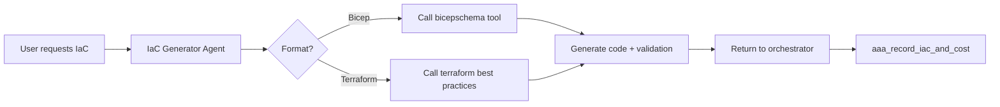

# AAA Agent System Review & Recommendations

**Date:** January 24, 2026  
**Objective:** Review GitHub Copilot custom agent patterns and propose improvements to AAA agent system prompts and LangGraph architecture

---

## Executive Summary

After reviewing 13 GitHub Copilot custom agent files against our current AAA system prompts, I've identified **critical gaps** in our agent's behavior patterns and **opportunities to enhance** both the prompt engineering and agent architecture.

**Key Findings:**
- ✅ **Strengths:** Our WAF-first approach, conflict resolution, and mandatory documentation search are strong
- ⚠️ **Gaps:** Missing phased development strategy, weak NFR analysis, no diagram quality control, insufficient IaC integration
- 🎯 **Opportunity:** Add specialized sub-agents for architecture planning, IaC generation, and SaaS-specific guidance

---

## Detailed Comparison Analysis

### 1. **Documentation Search & Citation Behavior** ✅ KEEP MCP PRIMARY

#### Reference Agents (azure-principal-architect, azure-saas-architect)
- **Pattern:** "Always use Microsoft documentation tools FIRST"
- **Search Strategy:** Explicit documentation URLs in instructions
- **Citation Format:** Mandatory URL references in every recommendation

#### Our Current AAA Prompt
- ✅ **Good:** `kb_search` first, then `microsoft_docs_search` via MCP
- ✅ **Good:** "ALL guidance must come from official documentation"
- ⚠️ **Gap:** Should emphasize MCP precision over direct web queries
- ⚠️ **Gap:** Citation format not specified (should we require markdown links?)

**User Feedback:**
> "Usage of learn MCP is stronger than querying directly the web. We should keep the MCP but be more precise on what query to do, not pushing the agent to query the web directly."

**Recommendation (Updated):**
```yaml
# Add to system_prompt section
**Documentation Search Strategy (MCP-First):**
- ALWAYS use MCP tools (microsoft_docs_search, microsoft_code_sample_search, microsoft_docs_fetch) as primary source
- Construct PRECISE queries: Include service name + specific feature (e.g., "Azure SQL Database Private Link configuration" not just "SQL security")
- NEVER suggest external web search or generic search engines
- Cite sources as markdown links: [Service Name](https://learn.microsoft.com/...)
- Include specific WAF pillar URLs when referencing framework:
  - WAF Overview: https://learn.microsoft.com/azure/well-architected/
  - Security: https://learn.microsoft.com/azure/well-architected/security/
  - Reliability: https://learn.microsoft.com/azure/well-architected/reliability/
  - Cost: https://learn.microsoft.com/azure/well-architected/cost/
  - Performance: https://learn.microsoft.com/azure/well-architected/performance-efficiency/
  - Operations: https://learn.microsoft.com/azure/well-architected/operational-excellence/
```

---

### 2. **Requirements Clarification Strategy**

#### Reference Agent (azure-principal-architect)
```markdown
**Ask Before Assuming**: When critical architectural requirements are unclear or missing, 
explicitly ask the user for clarification rather than making assumptions. Critical aspects include:
- Performance and scale requirements (SLA, RTO, RPO, expected load)
- Security and compliance requirements (regulatory frameworks, data residency)
- Budget constraints and cost optimization priorities
- Operational capabilities and DevOps maturity
- Integration requirements and existing system constraints
```

#### Our Current AAA Prompt
- ✅ **Good:** "Always Clarify & Challenge" section
- ⚠️ **Gap:** Not structured as explicit bullet points for clarity
- ⚠️ **Gap:** Missing "Ask before assuming" principle explicitly stated
- ⚠️ **Gap:** No mention of "Operational capabilities" or "DevOps maturity"

**Recommendation:**
```yaml
# Enhance "Always Clarify & Challenge" section with explicit checklist
**Critical Requirements Checklist (Ask Before Assuming):**
Before making architectural recommendations, verify these critical aspects:
- [ ] Performance & Scale: SLA targets, RTO/RPO, expected load, growth projections
- [ ] Security & Compliance: Regulatory frameworks (GDPR, HIPAA, etc.), data residency
- [ ] Budget: CapEx vs OpEx preference, cost optimization priorities
- [ ] Operations: Team DevOps maturity, monitoring capabilities, support model
- [ ] Integration: Existing systems, legacy constraints, migration requirements
- [ ] Data: Volume, velocity, variety, retention requirements
- [ ] Users: Geographic distribution, authentication model, access patterns

When any of these are unclear, ASK specifically rather than assuming.
```

---

### 3. **Phased Development Approach** ⭐ CRITICAL GAP - TARGET ARCHITECTURE PRIMARY

#### Reference Agent (arch.agent)
```markdown
**When complexity is high**: If the system architecture or flow is complex, break it down into phases:

### Initial Phase
- Focus on MVP (Minimum Viable Product) functionality
- Include core components and essential features
- Simplify integrations where possible
- Create diagrams showing the initial/simplified architecture
- Clearly label as "Initial Phase" or "Phase 1"

### Final Phase
- Show the complete, full-featured architecture
- Include all advanced features and optimizations
- Show complete integration landscape
- Add scalability and resilience features
- Clearly label as "Final Phase" or "Target Architecture"

**Provide clear migration path**: Explain how to evolve from initial phase to final phase.
```

#### Our Current AAA Prompt
- ❌ **MISSING:** No phased development strategy at all
- ❌ **MISSING:** No MVP vs full architecture distinction
- ❌ **MISSING:** No migration path guidance

**User Feedback:**
> "I like the MVP approach but the goal is to provide the target architecture not only the MVP. So we must keep both and provide a means for the human architect to skip the MVP if she wants."

**This is a CRITICAL gap.** Real-world projects need both complete target architecture AND optional MVP path.

**Recommendation (Updated):** Add new section to system_prompt:
```yaml
**11. Target Architecture with Optional MVP Path**

**PRIMARY OUTPUT: Always provide the complete TARGET ARCHITECTURE first.**

Your architecture proposal MUST include:
1. **Target Architecture (Complete)** - Full production-ready design
   - All required Azure services and configurations
   - Multi-region setup (if needed for requirements)
   - Complete security controls (WAF-aligned)
   - Full automation (IaC, CI/CD, monitoring)
   - Advanced features and optimizations
   - Label diagrams as "[Target Architecture]"

2. **Simplified MVP Path (Optional)** - Offer if complexity is high
   - ASK: "Would you like me to also propose a simplified MVP path for faster initial delivery?"
   - Only provide if user confirms interest
   - When provided, clearly show what is deferred (not removed):
     - "Deferred to Phase 2: Multi-region, advanced monitoring, etc."
   - Label diagrams as "[Phase 1 - MVP]" vs "[Target Architecture]"

**Migration Path (if MVP provided):**
For phase transition, specify:
- Components to add (not replace)
- Configuration enhancements
- Data migration strategy (if applicable)
- Zero-downtime transition approach
- Rollback plan

**IMPORTANT:** 
- Never assume user wants MVP - always show target architecture first
- MVP is an OPTION for faster delivery, not a replacement for proper design
- Human architect can skip MVP entirely and go straight to target architecture
```

---

### 4. **Non-Functional Requirements (NFR) Analysis** ⭐ MAJOR GAP

#### Reference Agent (arch.agent)
```markdown
For EVERY diagram you create, you must provide:
...
5. **NFR Considerations**: How the design addresses non-functional requirements:
   - **Scalability**: How the system scales
   - **Performance**: Performance considerations and optimizations
   - **Security**: Security measures and controls
   - **Reliability**: High availability and fault tolerance
   - **Maintainability**: How the design supports maintenance and updates
```

#### Our Current AAA Prompt
- ⚠️ **Partial:** NFRs mentioned in requirement extraction, but not systematically analyzed
- ❌ **MISSING:** No explicit NFR analysis section in diagram generation
- ❌ **MISSING:** No maintainability consideration

**Recommendation:**
```yaml
# User Feedback:**
> "For the diagram I like the addition but we must also keep the approach C4 and not only focusing on technical diagram but also function/business flows."

**Recommendation (Updated):**
```yaml
# Add to "Output Structure" section (point 7)

C. **Diagrams with NFR Analysis (C4 + Functional Flows)**
Generate Mermaid diagrams that are:
- Syntactically valid
- Reflecting only validated decisions
- **Aligned with C4 model (System Context, Container, Component)**
- **Include functional/business flow diagrams** (user journeys, business processes)
- **ANNOTATED with NFR considerations:**

**C4 Diagrams (Technical Architecture):**
- System Context: System + actors + external systems
- Container: Azure services + data flows
- Component: Internal structure (when needed)

**Functional Flow Diagrams (Business Perspective):**
- User journey flows (authentication, core transactions)
- Business process flows (order fulfillment, payment processing, etc.)
- Cross-system integration flowss" section:
- **Scalability:** How components scale (horizontal/vertical), auto-scaling triggers
- **Performance:** Latency targets, throughput capacity, caching strategy
- **Security:** Authentication/authorization flow, network boundaries, encryption
- **Reliability:** HA configuration, failover mechanisms, RTO/RPO alignment
- **Maintainability:** Update strategy, versioning approach, operational complexity
- **Trade-offs:** Explicit statement of what was sacrificed for optimization
```

---

### 5. **Diagram Quality & Explanation Standards**

#### Reference Agent (arch.agent)
- **Mandatory diagrams:** 5-6 specific diagram types (System Context, Component, Deployment, Data Flow, Sequence, ERD)
- **Explanation requirement:** Every diagram MUST have detailed explanation
- **Mermaid syntax:** Explicitly required

#### Our Current AAA Prompt
- ✅ **Good:** "Generate Mermaid or PlantUML"
- ⚠️ **Gap:** No explicit diagram type requirements
- ⚠️ **Gap:** No explanation quality standards

**Recommendation:**
```yaml
**7.C Diagram Standards (Enhanced)**

**Mandatory Diagram Types (based on C4 model):**
1. **System Context Diagram** - System + external actors + boundaries
2. **Container Diagram** - Major Azure services + data flows
3. **Deployment Diagram** - Resource groups, regions, network topology
4. **Sequence Diagram** - Key user flows (authentication, core transactions)

**Optional Diagrams (when relevant):**
5. **Data Flow Diagram** - For data-intensive workloads
6. **Network Diagram** - For complex networking (hub-spoke, firewall rules)
7. **Security Architecture** - For high-security or compliance-driven projects

**Diagram Format:**
- MUST use Mermaid syntax (no PlantUML unless explicitly requested)
- MUST be syntactically valid (test before inclusion)
- MUST use clear node labels (avoid abbreviations)
- MUST show directional relationships with arrows
OPTIONAL CAPABILITY

#### Reference Agent (azure-saas-architect)
- **B2B vs B2C distinction:** Explicit recognition that different business models need different architectures
- **Tenant isolation patterns:** Shared, siloed, pooled models
- **Noisy neighbor mitigation:** Explicit concern
- **Deployment stamps pattern:** Reference to Microsoft pattern

#### Our Current AAA Prompt
- ❌ **MISSING:** No awareness of SaaS scenarios
- ❌ **MISSING:** No tenant isolation considerations
- ❌ **MISSING:** No B2B vs B2C distinction

**User Feedback:**
> "On the SaaS model be careful to not push the AAA to only proposing SaaS model. It must be flexible enough to propose SaaS when it's required or asked by the human architect."

**Recommendation (Updated):** This is a **specialized capability** that should be a **separate LangGraph node/agent**, activated ONLY when SaaS requirements are detected or explicitly requested.

**Proposal: Create optional `saas_advisor` sub-agent** (see LangGraph section below)

**Trigger Conditions (DO NOT activate otherwise):**
- User explicitly mentions "SaaS", "multi-tenant", "B2B SaaS", "B2C SaaS"
- Requirements document contains SaaS patterns (tenant management, subscription billing, etc.)
- User asks "should this be SaaS?" or "is SaaS appropriate?"

**IMPORTANT:** Do not assume every web application should be SaaS. Many enterprise applications are single-tenant or customer-hosted.models need different architectures
- **Tenant isolation patterns:** Shared, siloed, pooled models
- **Noisy neighbor mitigation:** Explicit concern
- **Deployment stamps pattern:** Reference to Microsoft pattern

#### Our Current AAA Prompt
- ❌ **MISSING:** No awareness of SaaS scenarios
- ❌ **MISSING:** No tenant isolation considerations
- ❌ **MISSING:** No B2B vs B2C distinction

**Recommendation:** This is a **specialized capability** that should be a **separate LangGraph node/agent**, not added to the main prompt.

**Proposal: Create `saas_advisor` sub-agent** (see LangGraph section below)

---

### 7. **IaC Generation Integration** ⭐ CRITICAL GAP

#### Reference Agents (bicep-plan, azure-iac-generator)
- **Workflow:** Requirements → Schema Validation → Best Practices → Code Generation
- **Mandatory pre-generation steps:** Must call format-specific tools (bicepschema, terraform best practices)
- **Azure naming compliance:** Enforced for all resources
- **Modular structure:** Environments, modules, policies folders

#### Our Current AAA Prompt
- ✅ **Good:** `aaa_record_iac_and_cost` tool exists
- ⚠️ **Gap:** No IaC generation workflow in prompt
- ⚠️ **Gap:** No mention of Bicep/Terraform standards
- ❌ **MISSING:** No schema validation requirement

**Recommendation:** This should be a **separate LangGraph sub-agent** that follows the reference agent's workflow.

**Proposal: Create `iac_generator` sub-agent** (see LangGraph section below)

---

### 8. **Confidence-Based Recommendations**

#### Reference Agent (azure-principal-architect)
```markdown
**Response Structure:**
- **Requirements Validation**: If critical requirements are unclear, ask specific questions before proceeding
- **Documentation Lookup**: Search docs for service-specific best practices
- **Primary WAF Pillar**: Identify the primary pillar being optimized
- **Trade-offs**: Clearly state what is being sacrificed for the optimization
```

#### Our Current AAA Prompt
- ✅ **Good:** "Confidence-Based Recommendations" section exists
- ✅ **Good:** Present 2-3 options when moderate confidence
- ⚠️ **Gap:** Not structured as explicit response template

**Recommendation:**
```yaml
# Enhance existing "Confidence-Based Recommendations" section

**Response Structure (when moderate confidence):**

Your response MUST follow this template:

**Requirements Validation:**
[List any unclear requirements that affect the decision]

**Documentation Analysis:**
[Cite specific Microsoft Learn URLs consulted]

**Primary WAF Pillar:**
**User Feedback:**
> "I think we should have other agents actually. I am worried that the main agent has too much to do with a huge and confused system prompt."

**Concern Validated:** The current `agent_prompts.yaml` is **357 lines** and growing. Adding more instructions will make it unmanageable. We need to decompose responsibilities into specialized agents.

### Proposed Multi-Agent Architecture

I recommend evolving to a **hierarchical LangGraph** with specialized sub-agents to reduce main agent complexity
- **Description:** [What this option does]
- **WAF Impact:** [How it affects WAF pillars]
- **Trade-offs:** [What you sacrifice]
- **Best for:** [Scenarios where this is optimal]
- **Source:** [Microsoft Learn URL]

**Option 2: [Name]**
[Same structure]

**Architect choice required:**
Which option aligns with your priorities?
```

---

## LangGraph Architecture Recommendations

### Current Architecture Analysis

Based on the codebase, our current agent is a **single ReAct agent** with tools. This is appropriate for conversational guidance but **limits specialization**.

### Proposed Multi-Agent Architecture

I recommend evolving to a **hierarchical LangGraph** with specialized sub-agents:

```
┌─────────────────────────────────────────────────────────┐
│         Orchestrator (Main AAA Agent)                   │
│  - Route tasks to specialists                           │
│  - Maintain conversation context                        │
│  - Validate cross-agent outputs                         │
└─────────────────────┬───────────────────────────────────┘
                      │
          ┌───────────┼───────────┬──────────────┐
          │           │           │              │
    ┌─────▼────┐ ┌────▼─────┐ ┌──▼──────┐ ┌────▼────────┐
    │Architecture│ │SaaS      │ │IaC      │ │Cost         │
    │Planner     │ │Advisor   │ │Generator│ │Estimator    │
    │            │ │          │ │         │ │             │
    │- NFR       │ │- B2B/B2C │ │- Bicep  │ │- Azure      │
    │  analysis  │ │  patterns│ │  schema │ │  Pricing    │
    │- Phased    │ │- Tenant  │ │  lookup │ │  API        │
    │  delivery  │ │  isolation│ │- Terraform│ │- TCO      │
    │- Diagram   │ │- Noisy   │ │  best   │ │  analy, OPTIONAL ACTIVATION ONLY)

**IMPORTANT:** This agent should NOT be invoked by default. Only activate when SaaS is explicitly in scope.

**Trigger Conditions (Strict):**
- User explicitly mentions "SaaS", "multi-tenant", "B2B SaaS", "B2C SaaS"
- User asks "should this be SaaS?" or requests SaaS architecture evaluation
- Requirements document explicitly states multi-tenant or subscription-based model

**DO NOT Trigger When:**
- Building a regular web application
- Enterprise single-tenant application
- Customer-hosted solutions
- Internal tools

**Responsibilities (when activated):**
- B2B vs B2C distinction
- Tenant isolation strategy (shared/siloed/pooled)
- Noisy neighbor mitigation
- Deployment stamps recommendation
- SaaS-specific WAF guidance

**Prompt Template:** Based on `azure-saas-architect.agent.md`

**Integration:**
- Works alongside main agent (not replacing)
- Only injects SaaS considerations when explicitly in scope
- Validates multi-tenant designs when requested

**Prompt Template:** Based on `arch.agent.md` with AAA-specific enhancements

**Integration:**
- Input: Requirements from Orchestrator
- Output: Architecture plan → pass to `aaa_generate_candidate_architecture`
- Return to: Orchestrator for validation

---

#### 2. **SaaS Advisor Sub-Agent** (Priority: MEDIUM)

**Trigger Conditions:**
- User mentions "SaaS", "multitenant", "B2B", "B2C"
- Workload classification indicates SaaS pattern

**Responsibilities:**
- B2B vs B2C distinction
- Tenant isolation strategy (shared/siloed/pooled)
- Noisy neighbor mitigation
- Deployment stamps recommendation
- SaaS-specific WAF guidance

**Prompt Template:** Based on `azure-saas-architect.agent.md`

**Integration:**
- Works alongside main agent (not replacing)
- Injects SaaS-specific considerations into architecture planner
- Validates multi-tenant designs

---

#### 3. **IaC Generator Sub-Agent** (Priority: HIGH)

**Trigger Conditions:**
- User requests "generate Bicep", "create Terraform", "IaC code"
- Stage 6 in workflow (after ADRs finalized)

**Responsibilities:**
- Schema validation (Bicep schema lookup)
- Best practices application (Terraform best practices tool)
- Azure naming compliance
- Modular structure generation
- Parameter file creation

**Prompt Template:** Based on `bicep-plan.agent.md` + `azure-iac-generator.agent.md`

**Workflow:**


---

#### 4. **Cost Estimator Sub-Agent** (Priorit - WITH CAUTION

**User Concern:** "I am worried that the main agent has too much to do with a huge and confused system prompt."

**Risk Mitigation Strategy:**
- **DO NOT** add all enhancements to main prompt at once
- **Prioritize** only critical additions that improve behavior without bloat
- **Move specialized knowledge** to sub-agents (IaC, SaaS) instead of main prompt
- **Consider refactoring** existing prompt for clarity before adding more

**Critical Additions Only (Main Prompt):**
1. ✅ Add MCP-first documentation strategy (replace existing section)
2. ✅ Add "Ask Before Assuming" checklist (concise format)
3. ✅ Add Target Architecture + Optional MVP instruction (replace, not add)
4. ✅ Add C4 + Functional Flow diagram requirements (enhance existing)
5. ❌ DO NOT add NFR analysis to main prompt → Move to Architecture Planner sub-agent
6. ❌ DO NOT add SaaS instructions to main prompt → Separate SaaS Advisor agent

**Estimated Effort:** 2-3 hours (prompt editing + testing) + refactoring review
- TCO calculation (3-year projection)
- Cost optimization recommendations
- Reserved Instance / Savings Plan analysis

**Prompt Template:** New (not in reference agents, but needed)

**Integration:**
- Takes architecture proposal as input
- Outputs pricing lines → `aaa_record_iac_and_cost`
- Suggests cost optimizations → back to orchestrator

---

### Implementation Approach

#### Phase 1: Enhance Main Prompt (Immediate)
1. ✅ Add explicit documentation URLs
2. ✅ Add "Ask Before Assuming" checklist
3. ✅ Add Phased Development section
4. ✅ Add NFR Analysis re - Main Prompt Improvements

**WARNING:** Current prompt is 357 lines and complex. Add conservatively to avoid confusion.

1. **Refactor existing prompt for clarity** BEFORE adding new content
   - Risk: Adding to already-large prompt creates confusion
   - Action: Review and consolidate redundant sections first

2. **Add Target Architecture + Optional MVP** (replace existing stage approach)
   - Risk: Without this, we don't provide complete architecture vision
   - Impact: Ensures architects get full target design with optional phasing
   - **User requirement:** "Goal is to provide the target architecture not only the MVP"

3. **Emphasize MCP-first + precise - Multi-Agent Decomposition

**STRATEGY:** Move complexity OUT of main prompt INTO specialized agents.

4. **Architecture Planner sub-agent** implementation (HIGH VALUE)
   - **Moves from main prompt:** NFR analysis, phased delivery logic, diagram generation
   - **Reduces main prompt by:** ~80-100 lines
   - Benefit: Specialized agent produces higher-quality architecture plans
   - Dependency: Requires LangGraph routing changes
   - **User concern addressed:** Reduces main agent complexity

5. **IaC Generator sub-agent** implementation (HIGH VALUE)
   - **Moves from main prompt:** IaC workflow details, Bicep/Terraform specifics
   - **Reduces main prompt by:** Can remove detailed IaC instructions
   - Benefit: Production-ready IaC with schema validation
   - Dependency: Integrate Bicep/Terraform tools
   - **User concern addressed:** Offloads specialized task from main agentical stakeholders
   - **User requirement:** "Keep C4 and also function/business flows"
**Estimated Effort:** 1-2 days

#### Phase 3: Add IaC Generator Sub-Agent (High Priority (OPTIONAL ACTIVATION ONLY)
   - **IMPORTANT:** Only invoke when SaaS explicitly in scope
   - **User requirement:** "Don't push AAA to only proposing SaaS model"
   - Trigger: User mentions "SaaS", "multi-tenant", or asks about SaaS suitability
   - Do NOT activate for regular web applications

7. **Cost Estimator sub-agent** for pricing integration
   - Move cost estimation logic out of main agent
   - Integrate Azure Pricing API

8. **Enhanced citation format** (markdown links to Microsoft Learn)
   - Already using MCP, just enforce consistent format
3. Add to LangGraph workflow (stage 6 routing)
4. Test Bicep and Terraform generation

**Estimated Effort:** 2-3 days

#### Phase 4: Add SaaS & Cost Sub-Agents (Medium Priority)
1. Create SaaS advisor prompt
2. Create cost estimator agent
3. Add to LangGraph as optional routes
4. Test with SaaS-specific scenarios

**Estimated Effort:** 2-3 days

---

## Immediate Action Items (Priority Order)

### 🔴 Critical (Do Now)
1. **Add Phased Development section** to system_prompt
   - Risk: Without this, we generate "big bang" architectures that overwhelm users
   - Impact: Improves project realism and deliverability

2. **Add NFR Analysis requirements** to diagram section
   - Risk: Our diagrams lack quality/depth compared to professional architects
   - Impact: Better decision justification and WAF alignment

3. **Add "Ask Before Assuming" checklist**
   - Risk: Agent makes assumptions about scale, security, budget
   - Impact: Reduces rework and misaligned recommendations

### 🟡 High Priority (This Sprint)
4. **Architecture Planner sub-agent** implementation
   - Benefit: Specialized agent produces higher-quality architecture plans
   - Dependency: Requires LangGraph routing changes

5. **IaC Generator sub-agent** implementation
   - Benefit: Production-ready IaC with schema validation
   - Dependency: Integrate Bicep/Terraform tools

### 🟢 Medium Priority (Next Sprint)
6. **SaaS Advisor sub-agent** for multi-tenant scenarios
7. **Cost Estimator sub-agent** for pricing integration
8. **Enhanced citation format** (markdown links to Microsoft Learn)

---

## Testing Strategy for Changes

### 1. Prompt Enhancement Testing
- **Method:** Run existing E2E scenario-a and scenario-behavior
- **Success Criteria:**
  - Agent asks clarifying questions when requirements incomplete
  - Agent proposes phased delivery for complex scenarios, **while respecting user feedback on maintaining flexibility and managing complexity**.

### Critical Gaps to Address (Updated Based on Feedback):

1. ❌ No target architecture + optional MVP strategy → **Fix: Always provide complete target architecture first, offer MVP as option**
2. ❌ Weak NFR analysis and diagram quality → **Fix: Move to Architecture Planner sub-agent (reduce main prompt complexity)**
3. ❌ No specialized IaC generation workflow → **Fix: Separate IaC Generator sub-agent**
4. ⚠️ Missing SaaS awareness → **Fix: Optional SaaS Advisor sub-agent (activate ONLY when SaaS explicitly in scope)**
5. ⚠️ Main prompt becoming too large/complex → **Fix: Multi-agent decomposition strategy**

### Recommended Architecture Evolution (Updated):

**Phase 1: Refactor + Conservative Enhancement (Immediate)**
- **Refactor** existing 357-line prompt for clarity and consolidation
- **Add** Target Architecture + Optional MVP section (replace existing stage logic)
- **Enhance** MCP-first documentation strategy (update existing section)
- **Add** C4 + Functional Flow diagram requirements (enhance existing)
- **Do NOT** bloat main prompt further - move complexity to sub-agents

**Phase 2: Multi-Agent Decomposition (High Priority)**
- **Architecture Planner sub-agent** → Moves NFR analysis, phased delivery, diagram generation OUT of main prompt
- **IaC Generator sub-agent** → Moves Bicep/Terraform workflow OUT of main prompt
- **Result:** Reduce main prompt complexity by ~100-150 lines

**Phase 3: Optional Specialized Agents (Medium Priority)**
- **SaaS Advisor sub-agent** → ONLY activate when SaaS explicitly mentioned (not default)
- **Cost Estimator sub-agent** → Pricing integration

### Expected Outcome:

- ✅ **Simpler main agent** with clearer responsibilities (addresses user concern)
- ✅ **Complete target architecture** with optional MVP path (addresses user requirement)
- ✅ **Better diagrams** with C4 + functional flows (addresses user requirement)
- ✅ **Flexible SaaS handling** - propose only when appropriate (addresses user requirement)
- ✅ **MCP-first documentation** with precise queries (addresses user requirement)
- ✅ **Enterprise-grade quality** through specialized sub-agents

### Key Principles Going Forward:

1. **Decompose, Don't Inflate:** Move specialized knowledge to sub-agents instead of bloating main prompt
2. **Target Architecture First:** Always provide complete vision, with MVP as optional path
3. **MCP-First:** Precise queries to Microsoft Learn MCP, avoid direct web search
4. **C4 + Functional:** Technical architecture AND business flow diagrams
5. **Flexible SaaS:** Only when relevant, not a default pattern to push

This approach brings AAA to **enterprise-grade quality** while maintaining **simplicity and flexibility** as requested
**Issue:** Adding more instructions may confuse the agent or exceed token limits.

**Mitigation:**
- Keep main prompt focused on orchestration
- Move specialized knowledge to sub-agents
- Use structured YAML sections for clarity

### Risk 2: LangGraph Routing Overhead
**Issue:** Multiple agents may increase latency and cost.

**Mitigation:**
- Use conditional routing (only invoke sub-agents when needed)
- Cache sub-agent outputs when appropriate
- Monitor token usage per agent

### Risk 3: Breaking Existing Behavior
**Issue:** Prompt changes may degrade current performance.

**Mitigation:**
- Version control all prompt changes
- Run regression tests before deployment
- Keep old prompt as fallback

---

## Conclusion

The reference GitHub Copilot agents demonstrate **state-of-the-art prompt engineering patterns** that we should adopt:

**Critical Gaps to Address:**
1. ❌ No phased development strategy
2. ❌ Weak NFR analysis and diagram quality
3. ❌ No specialized IaC generation workflow
4. ❌ Missing SaaS multi-tenant patterns

**Recommended Architecture Evolution:**
- **Phase 1:** Enhance main prompt (immediate, low risk)
- **Phase 2:** Add Architecture Planner and IaC Generator sub-agents (high value)
- **Phase 3:** Add SaaS and Cost sub-agents (specialized capabilities)

**Expected Outcome:**
- Better diagram quality and explanation depth
- More realistic, phased delivery proposals
- Production-ready IaC code generation
- Higher confidence recommendations with explicit trade-offs

This will bring AAA to **enterprise-grade quality** comparable to professional Azure principal architects.
