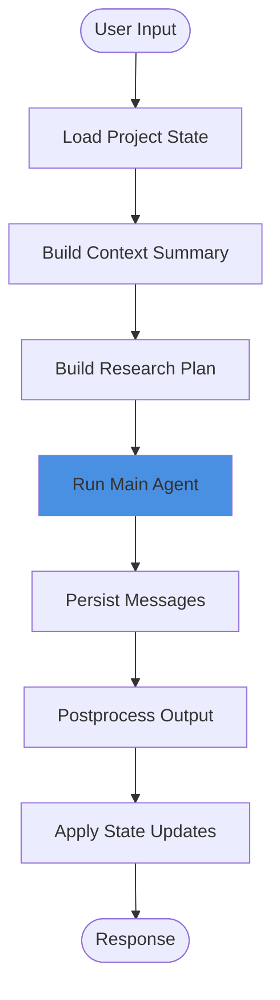
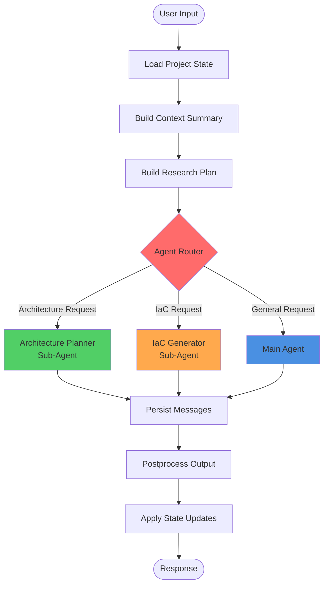
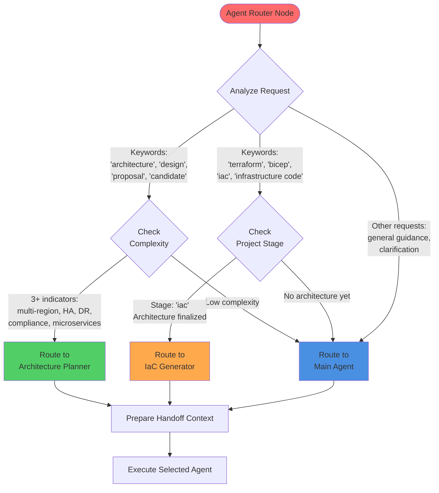

# Multi-Agent Architecture Design

**Version:** 1.0  
**Date:** 2026-01-24  
**Phase:** 2 - Multi-Agent Decomposition  
**Status:** Implementation In Progress

---

## Executive Summary

This document defines the multi-agent architecture for the Azure Architect Assistant (AAA), decomposing the monolithic 351-line agent prompt into specialized sub-agents. The goal is to reduce main agent complexity while improving specialization for architecture design and IaC generation tasks.

**Key Objectives:**
- Reduce main agent prompt from 351 lines to ~220-240 lines (-31%)
- Create Architecture Planner sub-agent (~80 lines) for design/NFR/diagrams
- Create IaC Generator sub-agent (~80 lines) for Bicep/Terraform generation
- Leverage existing LangGraph infrastructure for routing and orchestration
- Maintain backward compatibility and existing functionality

---

## Current Architecture Analysis

### Existing LangGraph Infrastructure

The AAA system already has a robust LangGraph implementation with 14 Python files:

**Graph Factory** (`graph_factory.py`):
- Linear workflow: load_state → build_summary → build_research → run_agent → persist_messages → postprocess → apply_updates
- Clean separation of concerns with individual nodes
- Database session injection via wrapper functions

**State Schema** (`state.py`):
- `GraphState` TypedDict with 30+ fields
- Includes Phase 6 fields for multi-agent: `selected_specialist`, `specialist_used`, `specialist_notes`
- Already supports multi-agent coordination

**Routing Infrastructure** (`nodes/stage_routing.py`):
- `ProjectStage` enum with 7 stages (clarify, propose_candidate, manage_adr, validate, pricing, iac, export)
- `classify_next_stage()` function with keyword + state-aware detection
- Extensible routing logic ready for sub-agent integration

**Multi-Agent Support** (`nodes/multi_agent.py`):
- `SpecialistType` enum (adr_specialist, validation_specialist, pricing_specialist, iac_specialist, general)
- `supervisor_node()` for specialist selection
- Pre-built specialist nodes (partially implemented)

**Key Insight:** The LangGraph infrastructure is already designed for multi-agent orchestration (Phase 6 fields). We can leverage this foundation for Phase 2 sub-agents.

---

## Target Multi-Agent Architecture

### Design Principles

1. **Specialization Over Generalization**: Sub-agents have narrow, deep expertise
2. **Explicit Handoff**: Main agent explicitly delegates to sub-agents via routing node
3. **State Continuity**: Project context flows seamlessly between agents
4. **Graceful Fallback**: Sub-agent failures don't break the system
5. **Tool Reuse**: Sub-agents access the same AAA tools as main agent

### Agent Roles

#### Main Agent (Enhanced)
**Responsibility:** Conversational orchestration, requirement clarification, general guidance

**Prompt Size:** ~220-240 lines (from 351)

**Capabilities:**
- Requirement clarification with Ask Before Assuming checklist
- Stage detection and routing decisions
- General Azure guidance
- Delegates to sub-agents for specialized tasks

**When to Delegate:**
- Architecture design → Architecture Planner
- IaC generation → IaC Generator

---

#### Architecture Planner Sub-Agent (NEW)
**Responsibility:** Complete architecture design with NFR analysis and diagram generation

**Prompt Size:** ~80 lines

**Expertise:**
- Target architecture design (production-ready, complete)
- NFR analysis (Scalability, Performance, Security, Reliability, Maintainability)
- C4 model diagrams (System Context, Container)
- Functional flow diagrams (user journeys, business processes)
- Phased delivery planning (MVP when requested)
- WAF/CAF alignment

**Invocation Triggers:**
- User explicitly requests "architecture", "design", "proposal", "candidate"
- Project stage is "propose_candidate"
- Complexity indicators exceed threshold (multi-region, HA, DR, compliance, microservices)

**Output:**
- Complete architecture proposal with diagrams
- NFR analysis for each diagram
- Optional MVP path (only if user requests)
- Structured format ready for `aaa_generate_candidate_architecture` tool

**Tools Available:**
- microsoft_docs_search (Azure service references)
- microsoft_code_sample_search (implementation patterns)
- microsoft_docs_fetch (detailed guides)
- kb_search (WAF/CAF patterns)
- aaa_generate_candidate_architecture (persist proposal)

---

#### IaC Generator Sub-Agent (NEW)
**Responsibility:** Infrastructure as Code generation with schema validation

**Prompt Size:** ~80 lines

**Expertise:**
- Bicep code generation with best practices
- Terraform code generation with best practices
- Azure resource schema validation
- Parameterization and modularization
- Bicep linting and validation
- Migration from one IaC format to another

**Invocation Triggers:**
- User explicitly requests "terraform", "bicep", "iac", "infrastructure code"
- Project stage is "iac"
- Architecture is finalized and ready for implementation

**Output:**
- Production-ready Bicep or Terraform code
- Parameterized templates with proper modularization
- Schema-validated resources
- Deployment instructions
- Structured format ready for `aaa_record_iac_and_cost` tool

**Tools Available:**
- mcp_bicep_experim_get_az_resource_type_schema (schema validation)
- mcp_bicep_experim_list_az_resource_types_for_provider (resource discovery)
- mcp_bicep_experim_get_bicep_best_practices (best practices)
- microsoft_code_sample_search (IaC examples)
- aaa_record_iac_and_cost (persist IaC artifacts)

---

## LangGraph Flow Design

### Current Flow (Phase 1)



**Issues with Current Flow:**
- Main agent handles ALL tasks (architecture, IaC, general guidance)
- 351-line prompt with mixed concerns
- No specialization for complex tasks

---

### Enhanced Flow with Multi-Agent Routing (Phase 2)



**Improvements:**
- Explicit routing based on request type
- Specialized agents for complex tasks
- Main agent focuses on orchestration
- Graceful fallback to main agent on errors

---

### Detailed Agent Router Logic



---

## State Schema Extensions

### New Fields for Multi-Agent Coordination

Add to `backend/app/agents_system/langgraph/state.py`:

```python
class GraphState(TypedDict, total=False):
    # ... existing fields ...
    
    # Phase 2: Multi-Agent Handoff
    current_agent: str | None  # "main", "architecture_planner", "iac_generator"
    agent_handoff_context: dict[str, Any] | None  # Context passed between agents
    routing_decision: dict[str, str] | None  # {"agent": "...", "reason": "..."}
    sub_agent_input: str | None  # Prepared input for sub-agent
    sub_agent_output: str | None  # Output from sub-agent
```

### Handoff Context Structure

```python
agent_handoff_context = {
    "project_context": str,  # Summary of project state
    "requirements": str,  # Extracted requirements
    "nfr_summary": str,  # Non-functional requirements
    "constraints": dict,  # Budget, timeline, compliance
    "previous_decisions": list,  # ADRs and choices made
    "user_request": str,  # Original user message
    "routing_reason": str,  # Why this agent was selected
}
```

---

## Routing Rules

### Rule 1: Route to Architecture Planner

**Conditions:**
```python
def should_route_to_architecture_planner(state: GraphState) -> bool:
    last_message = state["messages"][-1].content.lower()
    
    # Explicit architecture keywords
    arch_keywords = [
        "architecture", "design the architecture", "propose architecture",
        "candidate architecture", "architecture proposal", "system design",
        "how should i architect"
    ]
    if any(kw in last_message for kw in arch_keywords):
        return True
    
    # Project stage suggests architecture needed
    if state.get("next_stage") == "propose_candidate":
        return True
    
    # Complexity threshold
    project_context = state.get("context_summary", "")
    complexity_indicators = [
        "multi-region", "high availability", "disaster recovery",
        "compliance", "SOC 2", "HIPAA", "GDPR",
        "microservices", "event-driven", "real-time"
    ]
    complexity_count = sum(1 for ind in complexity_indicators if ind in project_context.lower())
    if complexity_count >= 3:
        return True
    
    return False
```

**Handoff Context Preparation:**
```python
handoff_context = {
    "project_context": state.get("context_summary", ""),
    "requirements": extract_requirements(state),
    "nfr_summary": extract_nfr(state),
    "constraints": extract_constraints(state),
    "previous_decisions": state.get("current_project_state", {}).get("adrs", []),
    "user_request": state["messages"][-1].content,
    "routing_reason": "Complex architecture design required with NFR analysis",
}
```

---

### Rule 2: Route to IaC Generator

**Conditions:**
```python
def should_route_to_iac_generator(state: GraphState) -> bool:
    last_message = state["messages"][-1].content.lower()
    
    # Explicit IaC keywords
    iac_keywords = [
        "terraform", "bicep", "iac", "infrastructure as code",
        "infrastructure code", "deploy", "provision"
    ]
    if any(kw in last_message for kw in iac_keywords):
        # Only route if architecture is finalized
        project_state = state.get("current_project_state", {})
        has_architecture = bool(project_state.get("candidateArchitectures"))
        return has_architecture
    
    # Project stage is IaC
    if state.get("next_stage") == "iac":
        return True
    
    return False
```

**Handoff Context Preparation:**
```python
handoff_context = {
    "project_context": state.get("context_summary", ""),
    "architecture": state.get("current_project_state", {}).get("candidateArchitectures", [])[0],
    "resource_list": extract_azure_resources(state),
    "constraints": extract_constraints(state),
    "iac_format": detect_iac_format(state["messages"][-1].content),  # "bicep" or "terraform"
    "user_request": state["messages"][-1].content,
    "routing_reason": "IaC generation for finalized architecture",
}
```

---

### Rule 3: Route to Main Agent (Default)

**Conditions:**
```python
def should_route_to_main_agent(state: GraphState) -> bool:
    # Default if no specialized agent matches
    return not (
        should_route_to_architecture_planner(state) or
        should_route_to_iac_generator(state)
    )
```

---

## Implementation Strategy

### Phase 2.1: Architecture Planner (Week 1)

1. **Create Architecture Planner Prompt** (`architecture_planner_prompt.yaml`)
   - Extract architecture design sections from main prompt
   - Add NFR analysis methodology
   - Add C4 diagram guidelines
   - Add target-first delivery strategy

2. **Implement Architecture Planner Node** (`nodes/architecture_planner.py`)
   - Load specialized prompt
   - Create MCPReActAgent with architecture tools
   - Handle handoff context
   - Return structured proposal

3. **Enhance Routing Logic** (`nodes/stage_routing.py`)
   - Add `should_route_to_architecture_planner()` function
   - Prepare handoff context with NFR extraction
   - Add logging for routing decisions

4. **Update Graph Factory** (`graph_factory.py`)
   - Add architecture_planner node
   - Add conditional edge from router to architecture_planner
   - Handle sub-agent errors with fallback

---

### Phase 2.2: IaC Generator (Week 2)

1. **Create IaC Generator Prompt** (`iac_generator_prompt.yaml`)
   - Extract IaC sections from main prompt
   - Add Bicep best practices
   - Add Terraform best practices
   - Add schema validation requirements

2. **Implement IaC Generator Node** (`nodes/iac_generator.py`)
   - Load specialized prompt
   - Create MCPReActAgent with Bicep/Terraform tools
   - Handle handoff context
   - Return validated IaC code

3. **Enhance Routing Logic** (`nodes/stage_routing.py`)
   - Add `should_route_to_iac_generator()` function
   - Validate architecture exists before routing
   - Add logging for routing decisions

4. **Update Graph Factory** (`graph_factory.py`)
   - Add iac_generator node
   - Add conditional edge from router to iac_generator
   - Handle sub-agent errors with fallback

---

### Phase 2.3: Main Agent Simplification (Week 3)

1. **Reduce Main Prompt** (`agent_prompts.yaml`)
   - Remove architecture design sections (~80 lines)
   - Remove IaC generation sections (~80 lines)
   - Add delegation instructions for sub-agents
   - Update version to 1.2
   - Target: 220-240 lines (from 351)

2. **Add Delegation Guidance**
   ```yaml
   **When to Delegate to Sub-Agents:**
   
   1. **Architecture Planner** - Delegate when:
      - User asks for architecture design, proposal, or candidate
      - Complex NFR analysis required (multi-region, HA, DR, compliance)
      - C4 diagrams needed
      - Phased delivery planning requested
   
   2. **IaC Generator** - Delegate when:
      - User asks for Terraform or Bicep code
      - Architecture is finalized and ready for implementation
      - IaC validation or migration needed
   
   Your role: Clarify requirements, detect intent, prepare handoff context.
   Sub-agents will handle specialized execution.
   ```

3. **Test Delegation**
   - Verify routing works correctly
   - Test handoff context preparation
   - Validate no regression in main agent capabilities

---

## Testing Strategy

### Unit Tests

1. **Routing Logic Tests** (`tests/test_multi_agent_routing.py`)
   ```python
   def test_route_to_architecture_planner_explicit_keyword():
       state = {"messages": [HumanMessage(content="Design the architecture")]}
       assert should_route_to_architecture_planner(state) == True
   
   def test_route_to_iac_generator_with_architecture():
       state = {
           "messages": [HumanMessage(content="Generate Bicep code")],
           "current_project_state": {"candidateArchitectures": [...]},
       }
       assert should_route_to_iac_generator(state) == True
   
   def test_route_to_main_agent_general_question():
       state = {"messages": [HumanMessage(content="What is Azure App Service?")]}
       assert should_route_to_main_agent(state) == True
   ```

2. **Handoff Context Tests** (`tests/test_handoff_context.py`)
   ```python
   def test_handoff_context_includes_nfr():
       state = {...}
       context = prepare_handoff_context(state, "architecture_planner")
       assert "nfr_summary" in context
       assert "requirements" in context
   ```

---

### Integration Tests

1. **E2E Architecture Request** (`tests/e2e/test_architecture_planner_e2e.py`)
   ```python
   async def test_architecture_planner_generates_complete_proposal():
       # Given: Project with requirements
       project_id = create_test_project(requirements={"sla": "99.9%", "scale": "1M users"})
       
       # When: User requests architecture
       response = await send_message(project_id, "Design the target architecture")
       
       # Then: Architecture Planner generates complete proposal
       assert "System Context Diagram" in response
       assert "Container Diagram" in response
       assert "NFR Analysis" in response
       assert "[Target Architecture]" in response
   ```

2. **E2E IaC Generation** (`tests/e2e/test_iac_generator_e2e.py`)
   ```python
   async def test_iac_generator_produces_valid_bicep():
       # Given: Project with finalized architecture
       project_id = create_test_project_with_architecture()
       
       # When: User requests Bicep code
       response = await send_message(project_id, "Generate Bicep code for this architecture")
       
       # Then: IaC Generator produces valid Bicep
       assert "resource " in response  # Bicep resource syntax
       assert extract_bicep_code(response)  # Extractable code block
   ```

---

### Regression Tests

1. **Main Agent Still Works** (`tests/test_main_agent_regression.py`)
   ```python
   async def test_main_agent_handles_general_questions():
       response = await send_message(project_id, "What is Azure SQL Database?")
       assert "Azure SQL Database" in response
       assert routing_decision["agent"] == "main"
   ```

2. **No Breaking Changes** (`tests/test_no_breaking_changes.py`)
   - Run all existing E2E tests
   - Verify golden outputs still match (or update if improved)
   - Check database persistence still works

---

## Metrics and Success Criteria

### Prompt Complexity Reduction

| Metric | Before | After | Target |
|--------|--------|-------|--------|
| Main Agent Prompt Size | 351 lines | ~220-240 lines | ≤250 lines |
| Architecture Planner Prompt | N/A | ~80 lines | ≤100 lines |
| IaC Generator Prompt | N/A | ~80 lines | ≤100 lines |
| **Total System Prompt Size** | 351 lines | ~380-400 lines | Acceptable for specialization |

**Rationale:** Total size increases slightly, but each prompt is focused and maintainable. Main agent complexity reduced by 31%.

---

### Routing Accuracy

| Scenario | Expected Agent | Accuracy Target |
|----------|---------------|-----------------|
| "Design the architecture" | Architecture Planner | 100% |
| "Generate Bicep code" | IaC Generator | 100% |
| "What is Azure SQL?" | Main Agent | 100% |
| Complex architecture (multi-region, HA, compliance) | Architecture Planner | ≥90% |
| General question | Main Agent | ≥95% |

---

### Quality Metrics

| Metric | Target |
|--------|--------|
| Architecture Planner: NFR analysis completeness | 100% (all 5 dimensions) |
| Architecture Planner: Diagram syntax validity | 100% (valid Mermaid) |
| IaC Generator: Bicep lint pass rate | ≥95% |
| IaC Generator: Schema validation pass rate | 100% |
| E2E test pass rate | 100% (no regressions) |

---

## Rollout Plan

### Week 1: Architecture Planner
- Day 1-2: Create prompt and node implementation
- Day 3: Integrate routing logic and update graph
- Day 4: Unit tests and integration tests
- Day 5: E2E testing and refinement

### Week 2: IaC Generator
- Day 1-2: Create prompt and node implementation
- Day 3: Integrate routing logic and update graph
- Day 4: Unit tests and integration tests
- Day 5: E2E testing and refinement

### Week 3: Main Agent Simplification
- Day 1: Reduce main prompt size
- Day 2: Add delegation instructions
- Day 3: Regression testing
- Day 4: Documentation updates
- Day 5: Final validation and deployment

---

## Risk Mitigation

### Risk 1: Routing Errors
**Mitigation:**
- Extensive unit tests for routing logic
- Fallback to main agent on uncertainty
- Logging all routing decisions for analysis

### Risk 2: Context Loss Between Agents
**Mitigation:**
- Comprehensive handoff context structure
- State persistence between nodes
- Validation tests for context completeness

### Risk 3: Sub-Agent Failures
**Mitigation:**
- Graceful error handling with fallback
- Main agent can complete task if sub-agent fails
- Detailed error logging for debugging

### Risk 4: Regression in Main Agent
**Mitigation:**
- Run full test suite before/after changes
- Golden output validation
- Gradual rollout with monitoring

---

## Future Enhancements (Post-Phase 2)

1. **More Specialized Agents**
   - Validation Specialist (WAF checks, security analysis)
   - Pricing Specialist (cost estimation, TCO analysis)
   - ADR Specialist (architecture decision documentation)

2. **Agent Collaboration**
   - Multi-agent conversations (Architecture Planner ↔ IaC Generator)
   - Iterative refinement based on feedback

3. **Learning from Usage**
   - Track routing accuracy over time
   - Adjust routing thresholds based on user satisfaction
   - A/B testing for prompt variations

---

## Appendix A: File Changes Summary

### New Files
- `backend/config/prompts/architecture_planner_prompt.yaml` (~80 lines)
- `backend/config/prompts/iac_generator_prompt.yaml` (~80 lines)
- `backend/app/agents_system/langgraph/nodes/architecture_planner.py` (~150 lines)
- `backend/app/agents_system/langgraph/nodes/iac_generator.py` (~150 lines)
- `tests/test_multi_agent_routing.py` (~200 lines)
- `tests/test_handoff_context.py` (~100 lines)
- `tests/e2e/test_architecture_planner_e2e.py` (~150 lines)
- `tests/e2e/test_iac_generator_e2e.py` (~150 lines)

### Modified Files
- `backend/config/prompts/agent_prompts.yaml` (351 → ~230 lines)
- `backend/app/agents_system/langgraph/state.py` (+5 fields)
- `backend/app/agents_system/langgraph/graph_factory.py` (+2 nodes, +2 conditional edges)
- `backend/app/agents_system/langgraph/nodes/stage_routing.py` (+100 lines routing logic)
- `docs/SYSTEM_ARCHITECTURE.md` (add multi-agent section)
- `docs/AGENT_ENHANCEMENT_IMPLEMENTATION_PLAN.md` (mark Phase 2 complete)
- `CHANGELOG.md` (add [1.2.0] entry)

---

## Appendix B: Prompt Size Breakdown

### Main Agent Prompt (Target: 220-240 lines)
```yaml
1. Role & Identity               (~20 lines)
2. Behavior Rules                (~30 lines)
3. Workload Classification       (~15 lines)
4. Requirement Clarification     (~40 lines, includes Ask Before Assuming)
5. Tools & MCP Strategy          (~40 lines)
6. Output Structure              (~30 lines, simplified)
7. Guardrails                    (~20 lines)
8. Delegation Instructions       (~25 lines, NEW)

Total: ~220 lines
```

### Architecture Planner Prompt (Target: ~80 lines)
```yaml
1. Role & Expertise              (~10 lines)
2. Input/Output Specification    (~10 lines)
3. Methodology                   (~40 lines)
   - Target architecture first
   - NFR-driven design
   - C4 diagrams
   - Functional flows
   - Optional MVP
4. Available Tools               (~10 lines)
5. Guardrails                    (~10 lines)

Total: ~80 lines
```

### IaC Generator Prompt (Target: ~80 lines)
```yaml
1. Role & Expertise              (~10 lines)
2. Input/Output Specification    (~10 lines)
3. Methodology                   (~40 lines)
   - Bicep best practices
   - Terraform best practices
   - Schema validation
   - Parameterization
   - Modularization
4. Available Tools               (~10 lines)
5. Guardrails                    (~10 lines)

Total: ~80 lines
```

---

**Document Status:** ✅ Complete - Ready for Implementation

**Next Steps:**
1. Implement Architecture Planner (Task 2.2)
2. Implement IaC Generator (Task 2.3)
3. Reduce Main Agent Prompt (Task 2.4)
4. Test and Document (Tasks 2.5-2.6)
