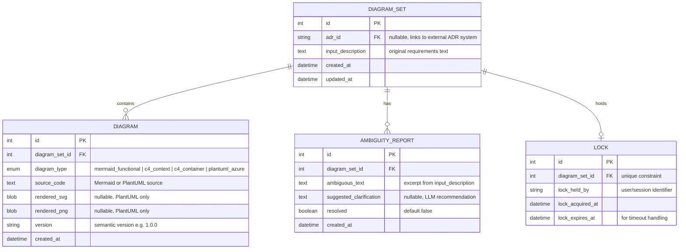

# Data Model: Architecture Diagram Generator

**Version**: 1.0.0  
**Last Updated**: 2025-12-17

---

## Overview

This data model supports versioned storage of architecture diagrams (Mermaid, PlantUML) with ambiguity tracking, ADR references, and pessimistic locking for concurrent access control.

**Key Design Principles**:
- **SRP**: Each entity has a single responsibility (diagram storage, locking, ambiguity tracking)
- **Zero Duplication**: Diagram versions share metadata through foreign key to DiagramSet
- **YAGNI**: Only P1 features modeled; versioning and ADR fields support P2 but unused initially
- **Isolation**: Separate `diagrams.db` database with independent session factory from main `projects.db` for scaling and deployment flexibility

---

## Entity Relationship Diagram



---

## Entity Definitions

### 1. DiagramSet

**Purpose**: Aggregate root for a collection of related diagrams generated from a single architecture description.

**Attributes**:

| Field | Type | Constraints | Description |
|-------|------|-------------|-------------|
| `id` | Integer | PK, Auto-increment | Unique identifier |
| `adr_id` | String(100) | Nullable, Indexed | Reference to external ADR system (FR-016) |
| `input_description` | Text | NOT NULL | Original functional/technical description provided by user (FR-001) |
| `created_at` | DateTime | NOT NULL, Default: UTC now | Timestamp of initial creation |
| `updated_at` | DateTime | NOT NULL, Default: UTC now | Timestamp of last modification |

**Relationships**:
- One-to-Many: DiagramSet → Diagram (cascade delete)
- One-to-Many: DiagramSet → AmbiguityReport (cascade delete)
- One-to-One: DiagramSet → Lock (cascade delete)

**Business Rules**:
- `input_description` length ≤ 50,000 characters (practical limit for LLM context)
- `adr_id` format validated if provided: alphanumeric + hyphens only
- Soft delete preferred over hard delete (add `deleted_at` field if needed in P2)

**Validation**:
```python
def validate_diagram_set(data: dict) -> bool:
    if not data.get("input_description") or len(data["input_description"]) > 50_000:
        raise ValueError("input_description required, max 50k chars")
    if data.get("adr_id") and not re.match(r'^[A-Za-z0-9-]+$', data["adr_id"]):
        raise ValueError("adr_id must be alphanumeric + hyphens")
    return True
```

---

### 2. Diagram

**Purpose**: Stores individual diagram artifacts (source code and rendered outputs) with versioning support.

**Attributes**:

| Field | Type | Constraints | Description |
|-------|------|-------------|-------------|
| `id` | Integer | PK, Auto-increment | Unique identifier |
| `diagram_set_id` | Integer | FK → DiagramSet.id, NOT NULL, Indexed | Parent diagram set |
| `diagram_type` | Enum | NOT NULL | Type: `mermaid_functional`, `c4_context`, `c4_container`, `plantuml_azure` (FR-002, FR-007, FR-013) |
| `source_code` | Text | NOT NULL | Raw Mermaid or PlantUML source code |
| `rendered_svg` | LargeBinary | Nullable | SVG rendering (PlantUML only, FR-015) |
| `rendered_png` | LargeBinary | Nullable | PNG rendering (PlantUML only, FR-015) |
| `version` | String(20) | NOT NULL | Semantic version (e.g., "1.0.0", "1.1.0") for FR-017 |
| `created_at` | DateTime | NOT NULL, Default: UTC now | Timestamp of this version creation |

**Relationships**:
- Many-to-One: Diagram → DiagramSet

**Business Rules**:
- `source_code` length ≤ 100,000 characters (technical limit)
- `diagram_type` dictates which fields are populated:
  - Mermaid types: `rendered_svg` and `rendered_png` are NULL
  - PlantUML types: `rendered_svg` and `rendered_png` are populated
- `version` follows semantic versioning: `MAJOR.MINOR.PATCH`
  - Breaking changes (user must re-input description): increment MAJOR
  - New diagram types added: increment MINOR
  - Bug fixes/refinements: increment PATCH
- Multiple Diagram rows with same `diagram_set_id` and `diagram_type` but different `version` represent version history (FR-017)

**Indexes**:
- Composite index: `(diagram_set_id, diagram_type, created_at DESC)` for version history queries (FR-020)

**Validation**:
```python
def validate_diagram(data: dict) -> bool:
    valid_types = {"mermaid_functional", "c4_context", "c4_container", "plantuml_azure"}
    if data.get("diagram_type") not in valid_types:
        raise ValueError(f"diagram_type must be one of {valid_types}")
    if not data.get("source_code") or len(data["source_code"]) > 100_000:
        raise ValueError("source_code required, max 100k chars")
    if not re.match(r'^\d+\.\d+\.\d+$', data.get("version", "")):
        raise ValueError("version must follow semantic versioning")
    return True
```

---

### 3. AmbiguityReport

**Purpose**: Tracks ambiguous elements detected by LLM analysis of input descriptions (FR-004, FR-005).

**Attributes**:

| Field | Type | Constraints | Description |
|-------|------|-------------|-------------|
| `id` | Integer | PK, Auto-increment | Unique identifier |
| `diagram_set_id` | Integer | FK → DiagramSet.id, NOT NULL, Indexed | Parent diagram set |
| `ambiguous_text` | Text | NOT NULL | Excerpt from input_description flagged as ambiguous |
| `suggested_clarification` | Text | Nullable | LLM-generated recommendation for clarification |
| `resolved` | Boolean | NOT NULL, Default: False | User marked as resolved (FR-006) |
| `created_at` | DateTime | NOT NULL, Default: UTC now | Timestamp of detection |

**Relationships**:
- Many-to-One: AmbiguityReport → DiagramSet

**Business Rules**:
- `ambiguous_text` length ≤ 5,000 characters (must be excerpt, not full description)
- `suggested_clarification` length ≤ 10,000 characters
- `resolved` toggled via user action; does not auto-resolve on re-generation
- Multiple AmbiguityReport rows per DiagramSet if multiple ambiguities detected

**Validation**:
```python
def validate_ambiguity_report(data: dict) -> bool:
    if not data.get("ambiguous_text") or len(data["ambiguous_text"]) > 5_000:
        raise ValueError("ambiguous_text required, max 5k chars")
    if data.get("suggested_clarification") and len(data["suggested_clarification"]) > 10_000:
        raise ValueError("suggested_clarification max 10k chars")
    return True
```

---

### 4. Lock

**Purpose**: Implements pessimistic locking for concurrent diagram editing (FR-022 clarification).

**Attributes**:

| Field | Type | Constraints | Description |
|-------|------|-------------|-------------|
| `id` | Integer | PK, Auto-increment | Unique identifier |
| `diagram_set_id` | Integer | FK → DiagramSet.id, NOT NULL, UNIQUE | Locked diagram set (one lock per set) |
| `lock_held_by` | String(255) | NOT NULL | User session ID or identifier |
| `lock_acquired_at` | DateTime | NOT NULL, Default: UTC now | Timestamp of lock acquisition |
| `lock_expires_at` | DateTime | NOT NULL | Expiration timestamp (10 minutes from acquisition) |

**Relationships**:
- One-to-One: Lock → DiagramSet

**Business Rules**:
- UNIQUE constraint on `diagram_set_id`: only one active lock per diagram set
- Lock expires after 10 minutes (`lock_expires_at = lock_acquired_at + 10 minutes`)
- Expired locks automatically released by background job or checked at acquisition time
- Lock acquisition fails if existing lock is active and not expired (HTTP 409 Conflict)
- Lock automatically released on successful update or explicit unlock API call

**Operations**:
```python
def acquire_lock(diagram_set_id: int, user_id: str) -> Lock:
    # Check for existing active lock
    existing = db.query(Lock).filter(
        Lock.diagram_set_id == diagram_set_id,
        Lock.lock_expires_at > datetime.utcnow()
    ).first()
    if existing:
        raise LockConflictError(f"Locked by {existing.lock_held_by}")
    
    # Create new lock
    lock = Lock(
        diagram_set_id=diagram_set_id,
        lock_held_by=user_id,
        lock_acquired_at=datetime.utcnow(),
        lock_expires_at=datetime.utcnow() + timedelta(minutes=10)
    )
    db.add(lock)
    db.commit()
    return lock

def release_lock(diagram_set_id: int, user_id: str) -> None:
    lock = db.query(Lock).filter(
        Lock.diagram_set_id == diagram_set_id,
        Lock.lock_held_by == user_id
    ).first()
    if lock:
        db.delete(lock)
        db.commit()
```

---

## Schema Migration Strategy

**Tool**: Alembic (SQLAlchemy migration framework)

**Migration Order**:
1. `001_create_diagram_sets.py`: Create DiagramSet table
2. `002_create_diagrams.py`: Create Diagram table with FK to DiagramSet
3. `003_create_ambiguity_reports.py`: Create AmbiguityReport table with FK to DiagramSet
4. `004_create_locks.py`: Create Lock table with UNIQUE constraint on diagram_set_id

**Backward Compatibility**:
- New columns added with DEFAULT values
- Deprecated columns marked as nullable before removal
- Version upgrades maintain existing diagram data

---

## Storage Size Estimates

| Entity | Avg Rows per DiagramSet | Avg Size per Row | Total per DiagramSet |
|--------|-------------------------|------------------|----------------------|
| DiagramSet | 1 | 10 KB | 10 KB |
| Diagram | 4 (functional + 2 C4 + PlantUML) | 90 KB (source + renders) | 360 KB |
| AmbiguityReport | 3 | 2 KB | 6 KB |
| Lock | 0-1 | 0.5 KB | 0.5 KB |
| **Total** | - | - | **~376 KB** |

**Scaling**: 1000 diagram sets with 3 versions each = ~1.1 GB (SQLite handles easily)

---

## Constitution Compliance

### Principle I: Single Responsibility
- ✅ **DiagramSet**: Manages metadata and relationships
- ✅ **Diagram**: Stores artifact data and versioning
- ✅ **AmbiguityReport**: Tracks quality concerns
- ✅ **Lock**: Handles concurrency control

### Principle III: Explicit Naming
- ✅ Field names are descriptive: `input_description` not `desc`, `lock_held_by` not `user`
- ✅ Enum values explicit: `mermaid_functional` not `mf`

### Principle IV: Zero Duplication
- ✅ Diagram versions share `diagram_set_id` (no metadata duplication)
- ✅ Ambiguity detection shared via FK (no copy-paste of `input_description`)

### Principle V: YAGNI
- ✅ No speculative fields (e.g., approval workflow, user comments) until required
- ⚠️ `adr_id` field exists but nullable (P2 feature, minimal complexity)

---

## Next Steps for Phase 1

1. Generate API contracts in `/contracts/` directory (OpenAPI schema)
2. Create quickstart.md with developer setup instructions
3. Update agent context by running `.specify/scripts/powershell/update-agent-context.ps1`
