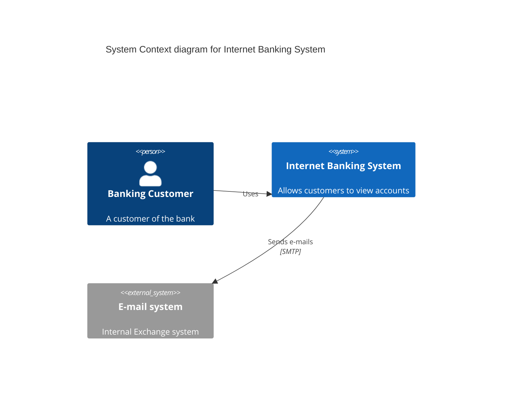
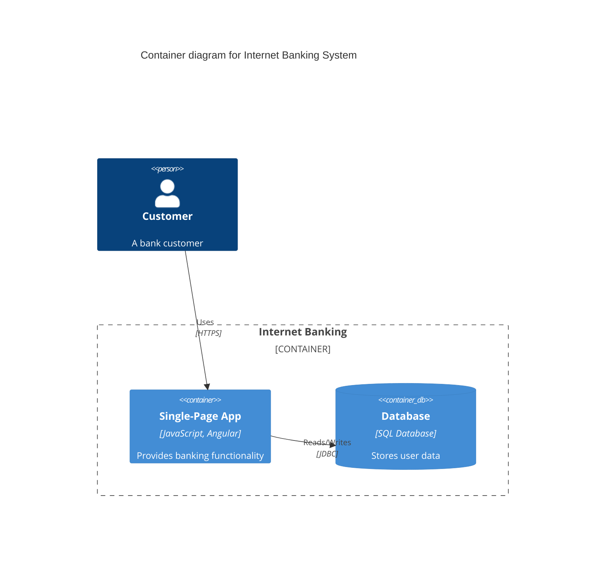
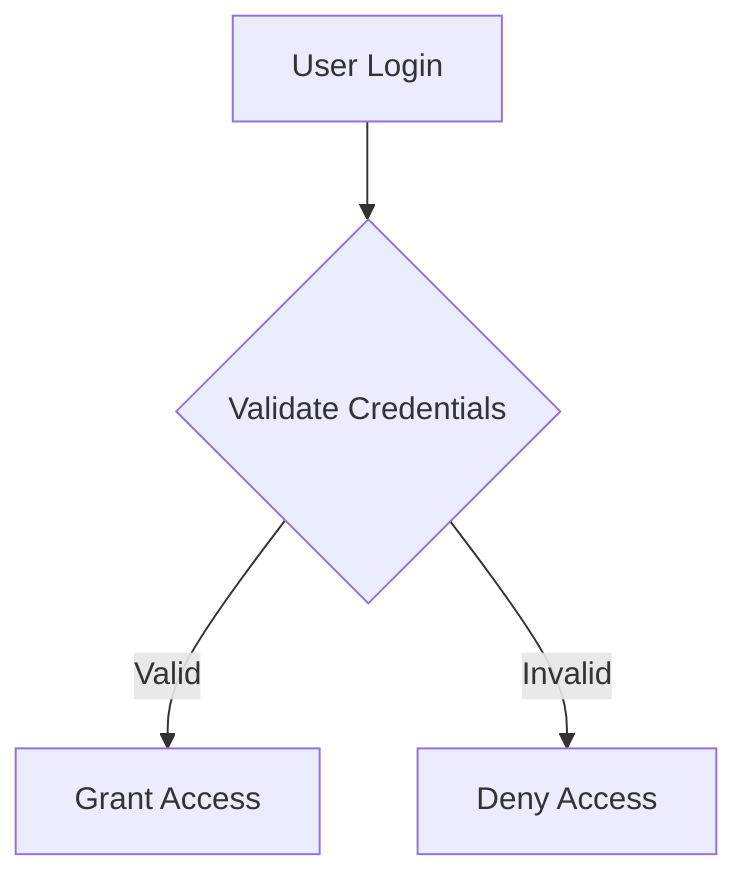

# Research: Architecture Diagram Generator

**Date**: 2025-12-17  
**Purpose**: Resolve technical unknowns from Technical Context to enable Phase 1 design

---

## Research Task 1: LLM Client Library Selection

**Decision**: Use OpenAI Python SDK with GPT-4 Turbo in separate diagram-specific client

**Rationale**:
- OpenAI SDK is mature, well-documented, and actively maintained
- GPT-4 Turbo offers best balance of quality and cost for diagram generation and ambiguity detection
- Native async support aligns with FastAPI
- Project constitution mandates Python 3.10+, OpenAI SDK supports Python 3.8+
- Structured output mode (JSON mode) useful for parsing diagram generation results
- Separate client in `backend/app/services/diagram/llm_client.py` allows diagram-specific rate limiting and retry configuration without affecting existing `llm_service.py`

**Alternatives Considered**:
- **Anthropic SDK (Claude)**: Excellent quality but higher cost per token; less ecosystem maturity
- **LangChain**: Adds unnecessary abstraction layer; violates YAGNI principle. Direct SDK usage simpler for this use case
- **Azure OpenAI**: Vendor lock-in concern; standard OpenAI SDK can target Azure OpenAI if needed later

**Implementation Notes**:
- Use `openai>=1.0.0` (modern async client)
- Configure retry logic with exponential backoff for rate limits
- Implement token counting to stay within context limits
- Use system/user message pattern for diagram generation prompts

---

## Research Task 2: PlantUML Rendering Library

**Decision**: Use `plantuml` Python package with local PlantUML JAR

**Rationale**:
- `plantuml` package provides Python wrapper around PlantUML JAR
- PlantUML official distribution includes Azure icon library (via Azure-PlantUML sprites)
- Server-side rendering required for Azure icons (can't delegate to frontend like Mermaid)
- Generates SVG and PNG outputs as required by FR-015
- Synchronous rendering acceptable given 30-second generation budget (SC-001)

**Alternatives Considered**:
- **PlantUML Server**: External dependency; adds network latency and availability risk
- **Kroki**: Third-party service; same availability concerns plus vendor dependency
- **py-plantuml**: Less maintained, limited format support

**Implementation Notes**:
- Package PlantUML JAR (plantuml.jar) with application or download during container build
- Require Java Runtime Environment (JRE) in container image
- Use `plantuml.PlantUML` class with output format parameter
- Cache rendered images to avoid re-rendering unchanged diagrams
- Implement timeout (10 seconds max) for complex diagrams

---

## Research Task 2b: C4-PlantUML with Azure Icons

**Decision**: Use C4-PlantUML macros with Azure-PlantUML sprite library for Azure service diagrams

**Rationale**:
- C4-PlantUML provides C4 model macros (Person, System, Container, Component) compatible with PlantUML
- Integrates seamlessly with Azure-PlantUML sprite library for official Azure service icons
- Syntax similar to Mermaid C4 (Person, System, Container, Boundary, Rel) - consistent LLM prompt patterns
- Part of PlantUML stdlib - no external dependencies beyond PlantUML JAR
- Supports all P1 C4 diagram types: Context (`C4_Context.puml`) and Container (`C4_Container.puml`)
- Server-side rendering with PlantUML enables Azure icon inclusion (icons not available in client-side Mermaid)

**C4-PlantUML Syntax with Azure Icons**:
```plantuml
@startuml
!include <C4/C4_Container>

' Include Azure-PlantUML sprites
!define AzurePuml https://raw.githubusercontent.com/plantuml-stdlib/Azure-PlantUML/release/2-2/dist
!include AzurePuml/AzureCommon.puml
!include AzurePuml/Databases/AzureCosmosDb.puml
!include AzurePuml/Compute/AzureFunctions.puml
!include AzurePuml/Web/AzureAPIManagement.puml

title Container diagram for Serverless API System

Person(user, "API Consumer", "External application or user")
System_Boundary(azure, "Azure Cloud") {
  Container(apim, "API Gateway", "Azure API Management", "Routes and secures API requests", $sprite="AzureAPIManagement")
  Container(functions, "Business Logic", "Azure Functions", "Handles API operations", $sprite="AzureFunctions")
  ContainerDb(cosmos, "Data Store", "Azure Cosmos DB", "Stores application data", $sprite="AzureCosmosDb")
}

Rel(user, apim, "Makes API calls", "HTTPS")
Rel(apim, functions, "Routes requests", "HTTPS")
Rel(functions, cosmos, "Reads/writes data", "SQL API")
@enduml
```

**Key C4-PlantUML Macros**:
- **C4 Context**: `Person`, `Person_Ext`, `System`, `System_Ext`, `System_Boundary`, `Enterprise_Boundary`
- **C4 Container**: All context macros + `Container`, `Container_Ext`, `ContainerDb`, `ContainerQueue`, `Container_Boundary`
- **Relationships**: `Rel`, `BiRel`, `Rel_U/D/L/R` (directional), `Rel_Back`, `Rel_Neighbor`
- **Styling**: `AddElementTag`, `AddRelTag`, `UpdateElementStyle`, `SHOW_LEGEND()`

**Azure-PlantUML Integration**:
- Include via `!include <C4/C4_Container>` and Azure sprite paths
- Azure icons added via `$sprite` parameter: `$sprite="AzureCosmosDb"`
- Azure-PlantUML library structure: `AzurePuml/Category/AzureServiceName.puml`
- Common categories: Compute, Databases, Web, Storage, Networking, AI, Analytics, Security

**Alternatives Considered**:
- **Plain PlantUML without C4 macros**: Less structured, no C4 model alignment, harder to maintain consistency
- **Mermaid with custom Azure icons**: Client-side rendering doesn't support custom sprites/images reliably
- **Separate Azure icon library**: C4-PlantUML + Azure-PlantUML combination is standard, well-documented

**Implementation Notes**:
- LLM prompts should include C4-PlantUML macro syntax examples (similar to Mermaid C4)
- Use `!include <C4/C4_Context>` for context diagrams (P1 US-1)
- Use `!include <C4/C4_Container>` for container diagrams (P1 US-1)
- Azure sprite includes must be added per diagram: `!include AzurePuml/Category/ServiceName.puml`
- Validate generated C4-PlantUML via PlantUML rendering (plantuml Python package)
- Cache rendered SVG/PNG to avoid re-rendering unchanged diagrams
- Document available Azure services in LLM prompt context (common services: Functions, CosmosDB, API Management, Storage, AKS, etc.)

**C4-PlantUML Documentation References**:
- GitHub: https://github.com/plantuml-stdlib/C4-PlantUML
- Azure-PlantUML: https://github.com/plantuml-stdlib/Azure-PlantUML

---

## Research Task 3: Mermaid C4 Diagram Support

**Decision**: Use native Mermaid C4 diagram syntax (built-in since Mermaid v10.0+)

**Rationale**:
- Mermaid.js natively supports C4 diagrams (`C4Context`, `C4Container`, `C4Component`, `C4Dynamic`, `C4Deployment`)
- Syntax compatible with C4-PlantUML, easing LLM prompt engineering (similar patterns)
- No additional library needed - standard Mermaid.js handles C4 rendering
- Supports all P1 diagram types: C4 Context (`C4Context`) and C4 Container (`C4Container`)
- Built-in styling for C4 elements: `Person`, `System`, `Container`, `Boundary`, relationships (`Rel`, `BiRel`)
- Frontend React component using `mermaid.js` library automatically supports C4 diagrams

**C4 Syntax Examples**:





**Alternatives Considered**:
- **C4-Builder library**: Third-party Python library to generate C4 syntax - adds unnecessary dependency when Mermaid native syntax suffices
- **Separate C4 tool**: Would require different rendering pipeline; violates SRP and increases complexity
- **PlantUML C4**: Considered but Mermaid C4 preferred for client-side rendering consistency

**Implementation Notes**:
- LLM prompts should include C4 syntax examples (Person, System, Container, Boundary, Rel)
- Use `C4Context` for system context diagrams (P1 US-1)
- Use `C4Container` for container diagrams (P1 US-1)
- Defer `C4Component`, `C4Dynamic`, `C4Deployment` to P2/P3 per YAGNI
- Validate C4 Mermaid syntax using `pyproject-mermaid>=0.1.0`
- Frontend component: Ensure `mermaid.js` version supports C4 (v10.0+)

**Mermaid.js Documentation Reference**: https://mermaid.js.org/syntax/c4.html

---

## Research Task 4: Mermaid Validation Library

**Decision**: Use `pyproject-mermaid` for syntax validation (supports C4 diagrams)

**Rationale**:
- Lightweight Python library for Mermaid diagram validation
- Validates all Mermaid diagram types including C4Context, C4Container
- No rendering needed (frontend React component handles display per clarification)
- Validates syntax before sending to frontend, enabling retry logic (FR-021)
- Returns specific error messages useful for LLM feedback in retry attempts
- Pure Python, no external dependencies or Node.js required

**Alternatives Considered**:
- **mermaid-cli (mmdc)**: Requires Node.js; heavy dependency for validation-only use case
- **Regex-based validation**: Fragile, doesn't catch semantic errors, hard to maintain
- **No validation**: Risk invalid Mermaid reaching frontend; poor UX

**Implementation Notes**:
- Use `pyproject-mermaid>=0.1.0`
- Validate before storage and before API response
- Include error details in retry prompt to LLM: "Previous generation failed: {error_message}"
- Document supported Mermaid diagram types: `flowchart`, `C4Context`, `C4Container`

---

## Research Task 4: Database Choice for Diagram Storage

**Decision**: SQLite with `aiosqlite` for async access in separate `diagrams.db`

**Rationale**:
- **Consistency**: SQLite already used in main project (`projects.db`); proven technology choice
- **Isolation**: Separate database allows independent backup, migration, and scaling strategies for diagram data
- **YAGNI**: No requirement for distributed database, high concurrency, or multi-GB storage
- **Simplicity**: File-based, no separate database server, easy local development
- **Async Support**: `aiosqlite` provides async SQLAlchemy support, aligns with FastAPI
- **Schema Evolution**: SQLAlchemy ORM handles migrations cleanly
- **Automated Deployment**: SQLite database file can be volume-mounted in container; no infrastructure provisioning

**Data Size Estimate**:
- Per DiagramSet: ~10KB Mermaid source + ~50KB PlantUML source + ~200KB SVG + ~100KB PNG = ~360KB
- 1000 diagram sets with 3 versions each = ~1.08GB (well within SQLite limits)

**Alternatives Considered**:
- **PostgreSQL**: Overkill for single-service use; requires separate container, connection pooling, more complex deployment
- **Azure Cosmos DB**: Cloud dependency for local development, cost concerns, unnecessary for document model without complex queries
- **File System**: No ACID guarantees, complex locking, version history management difficult

**Schema Design**:
```python
# Simplified ORM models
class DiagramSet(Base):
    __tablename__ = "diagram_sets"
    id = Column(Integer, primary_key=True)
    adr_id = Column(String, index=True, nullable=True)
    input_description = Column(Text, nullable=False)
    created_at = Column(DateTime, default=datetime.utcnow)
    lock_held_by = Column(String, nullable=True)  # Pessimistic locking
    lock_acquired_at = Column(DateTime, nullable=True)
    
class Diagram(Base):
    __tablename__ = "diagrams"
    id = Column(Integer, primary_key=True)
    diagram_set_id = Column(Integer, ForeignKey("diagram_sets.id"))
    diagram_type = Column(Enum("mermaid_functional", "c4_context", "c4_container", "plantuml_azure"))
    source_code = Column(Text, nullable=False)
    rendered_svg = Column(LargeBinary, nullable=True)  # PlantUML only
    rendered_png = Column(LargeBinary, nullable=True)  # PlantUML only
    version = Column(String, nullable=False)  # e.g., "1.0.0"
    created_at = Column(DateTime, default=datetime.utcnow)
    
class AmbiguityReport(Base):
    __tablename__ = "ambiguity_reports"
    id = Column(Integer, primary_key=True)
    diagram_set_id = Column(Integer, ForeignKey("diagram_sets.id"))
    ambiguous_text = Column(Text, nullable=False)
    suggested_clarification = Column(Text, nullable=True)
    resolved = Column(Boolean, default=False)
```

**Implementation Notes**:
- Use SQLAlchemy 2.0+ with async engine
- Implement database connection pooling even for SQLite (single writer, multiple readers)
- Store binary data (SVG/PNG) as BLOBs; consider file system storage if sizes grow >1MB per diagram
- Index on `adr_id`, `diagram_set_id`, `created_at` for filtering queries (FR-020)
- Implement database migration strategy (Alembic)

---

## Research Task 5: Tailwind CSS v4 Syntax and Best Practices

**Decision**: Use Tailwind CSS v4.1 with native CSS configuration and modern syntax

**Rationale**:
- **Modern CSS foundation**: Built on CSS variables, `@property`, and `color-mix()` - no JS config needed
- **Performance**: Vite plugin provides faster builds and better DX than PostCSS plugin
- **Simplified setup**: Single `@import "tailwindcss"` replaces multiple `@tailwind` directives
- **CSS-first configuration**: Theme customization via CSS `@theme` directive, not JavaScript
- **React 19 compatibility**: Works seamlessly with modern React and Vite 5+

**Major v4 Syntax Changes from v3**:

1. **Installation & Configuration**:
```typescript
// vite.config.ts - Use dedicated Vite plugin
import { defineConfig } from 'vite'
import tailwindcss from '@tailwindcss/vite'

export default defineConfig({
  plugins: [tailwindcss()],
})
```

```css
/* style.css - Single import replaces @tailwind directives */
@import "tailwindcss";

/* NOT v3 syntax: @tailwind base; @tailwind components; @tailwind utilities; */
```

2. **Renamed Utilities** (Critical for v4):
   - `shadow` → `shadow-sm` (default shadow renamed)
   - `shadow-sm` → `shadow-xs`
   - `rounded` → `rounded-sm`
   - `rounded-sm` → `rounded-xs`
   - `blur` → `blur-sm`, `blur-sm` → `blur-xs`
   - `outline-none` → `outline-hidden` (new `outline-none` sets `outline-style: none`)
   - `ring` → `ring-3` (default ring width changed from 3px to 1px)

3. **Opacity Modifiers** (Deprecated utilities removed):
   - ❌ `bg-opacity-50`, `text-opacity-75`, `border-opacity-25`
   - ✅ `bg-black/50`, `text-black/75`, `border-black/25`

4. **Important Modifier Position**:
```html
<!-- v3: Before utility name -->
<div class="!flex !bg-red-500"></div>

<!-- v4: After utility name -->
<div class="flex! bg-red-500!"></div>
```

5. **CSS Variables in Arbitrary Values**:
```html
<!-- v3: Square brackets -->
<div class="bg-[--brand-color]"></div>

<!-- v4: Parentheses -->
<div class="bg-(--brand-color)"></div>
```

6. **Theme Configuration via CSS**:
```css
/* v4: CSS-based theme configuration */
@theme {
  --font-display: "Satoshi", sans-serif;
  --breakpoint-3xl: 120rem;
  --color-brand-500: oklch(0.5 0.2 250);
}

/* Access via CSS variables */
.custom {
  color: var(--color-brand-500);
}

/* Or use in utilities */
<div class="text-brand-500"></div>
```

7. **Custom Utilities with @utility**:
```css
/* v3: @layer utilities */
@layer utilities {
  .tab-4 { tab-size: 4; }
}

/* v4: @utility directive */
@utility tab-4 {
  tab-size: 4;
}
```

8. **Default Color Changes**:
   - Border color: `gray-200` → `currentColor` (must specify explicitly)
   - Ring color: `blue-500` → `currentColor` (must specify explicitly)
   - Placeholder color: `gray-400` → `currentColor` at 50% opacity

9. **Hover on Mobile** (Media query change):
   - v4 uses `@media (hover: hover)` - hover only applies on devices that support it
   - Touch devices no longer trigger hover on tap

10. **Transform Properties** (Individual properties now):
   - `transform-none` no longer resets all transforms
   - Use specific resets: `scale-none`, `rotate-none`, `translate-none`

**Frontend Implementation Notes**:
- Install: `npm install tailwindcss @tailwindcss/vite`
- Configure Vite plugin in `vite.config.ts`
- Use single `@import "tailwindcss"` in main CSS
- Avoid opacity utilities (`bg-opacity-*`) - use slash syntax (`bg-black/50`)
- Always specify border/ring colors explicitly
- Place `!` modifier at end of utility name
- Use parentheses for CSS variables in arbitrary values: `bg-(--custom-color)`
- Custom utilities via `@utility` directive, not `@layer utilities`

**React Component Styling Best Practices**:
```tsx
// Correct v4 syntax for MermaidRenderer component
<div className="rounded-sm border border-gray-200 p-4 shadow-sm">
  <div className="bg-white/95 backdrop-blur-sm">
    {/* Mermaid diagram */}
  </div>
</div>

// NOT: rounded border shadow p-4 (missing explicit sizes/colors)
// NOT: bg-opacity-95 (deprecated, use bg-white/95)
// NOT: !rounded (important at wrong position, use rounded!)
```

**Browser Support**:
- Safari 16.4+, Chrome 111+, Firefox 128+
- Uses `@property` and `color-mix()` (no fallback for older browsers)
- If older browser support needed, stay on v3.4

**Documentation References**:
- Installation: https://tailwindcss.com/docs/installation/using-vite
- Upgrade Guide: https://tailwindcss.com/docs/upgrade-guide
- v4 Beta Docs: https://tailwindcss.com/docs/v4-beta

---

## Research Task 6: Best Practices for LLM-Powered Diagram Generation

**Decision**: Use structured prompts with examples and validation feedback loop

**Approach**:
1. **Prompt Structure** (System + User + Examples):
```
System: You are an expert at generating Mermaid/PlantUML diagrams from architecture descriptions.
Output ONLY valid diagram code. No explanations.

User: Generate a Mermaid flowchart diagram for: {description}

Examples:
Description: User logs in, system validates credentials, grants access
Output:

Now generate for: {actual_description}
```

2. **Validation Feedback Loop** (FR-021):
   - Generate diagram → Validate syntax → On error, retry with error context
   - Max 3 attempts per FR-021
   - Include error in retry prompt: "Previous attempt failed with: {error}. Please fix and regenerate."

3. **Ambiguity Detection Prompt**:
```
System: Analyze the following requirements description and identify any ambiguous or unclear elements.
Return JSON list of ambiguities with text reference and suggested clarification.

User: {description}

Output format:
[
  {
    "ambiguous_text": "...",
    "reason": "...",
    "suggested_clarification": "..."
  }
]
```

**Pattern for Prompt Reuse (Zero Duplication)**:
- Extract `PromptBuilder` class with methods: `build_generation_prompt()`, `build_ambiguity_prompt()`, `build_retry_prompt()`
- Share common patterns across diagram types (functional, C4, PlantUML)
- Customize per diagram type with template parameters

---

## Summary of Decisions

| Research Area | Decision | Blocker Resolved |
|---------------|----------|------------------|
| LLM Client | OpenAI Python SDK with GPT-4 Turbo | ✅ Primary Dependencies |
| PlantUML Rendering | `plantuml` package with local JAR | ✅ Primary Dependencies |
| Mermaid Validation | `pyproject-mermaid` library | ✅ Primary Dependencies |
| Database Storage | SQLite with `aiosqlite` | ✅ Storage choice |
| Diagram Generation Patterns | Structured prompts + validation feedback | ✅ Zero Duplication concern |

**All Technical Context NEEDS CLARIFICATION items resolved. Ready for Phase 1: Design.**
